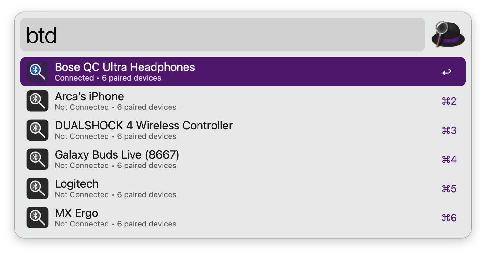
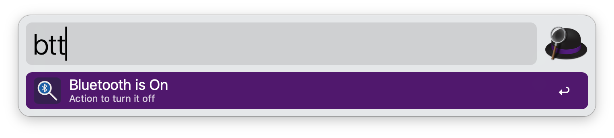

#  BlueScope

## Usage

Search your paired Bluetooth devices and toggle their connection status via the `btd` keyword.



* <kbd>↩︎</kbd> Toggle device connection

Alternatively, toggle Bluetooth power system-wide via the `btt` keyword.



* <kbd>↩︎</kbd> Turn Bluetooth on or off

## Setup

This workflow requires [blueutil](https://github.com/toy/blueutil) to be installed on your system.

Install via Homebrew:
```bash
brew install blueutil
```

Grant Alfred Bluetooth permissions in **System Settings** > **Privacy & Security** > **Bluetooth**.

## Configuration

Configure the trigger keywords in the Workflow's Configuration:

- **Device Toggle Keyword** (default: `btd`)
- **Bluetooth Power Keyword** (default: `btt`)
